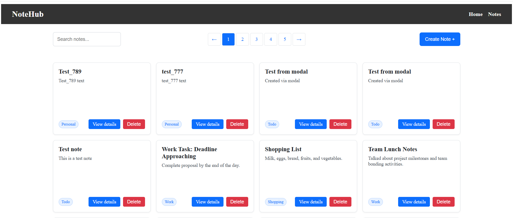

# 📝 NoteHub (Next.js)

A modern note-taking web application built with **Next.js (App Router)**, featuring server-side rendering, efficient data fetching, and a clean, scalable architecture.

---

## 🚀 Features

- 📄 View list of notes with pagination
- 🔍 Search notes with debounce
- ➕ Create new notes via modal form
- 📖 View note details (SSR + hydration)
- ⚡ Optimized data fetching with caching
- 🧠 Smart state management with React Query

---

## 🛠 Tech Stack

- **Next.js (App Router)**
- **React**
- **TypeScript**
- **TanStack Query**
- **Axios**
- **Formik + Yup**
- **CSS Modules**

---

## 📂 Project Structure

```
app/
  notes/
    [id]/
components/
  NoteList/
  NoteForm/
  Modal/
  Pagination/
  SearchBox/
lib/
  api.ts
types/
```

---

## ⚙️ Installation

```bash
git clone https://github.com/Sergii-Taran/06-notehub-nextjs
cd notehub
npm install
npm run dev
```

---

## 🌐 Environment Variables

Create a `.env.local` file:

```
NEXT_PUBLIC_API_URL=your_api_url
```

---

## 🧩 Architecture Highlights

### 📡 Data Fetching

- Centralized API layer (`lib/api`)
- Axios for HTTP requests
- Query keys structured for scalability

### ⚛️ State Management

- **TanStack Query**
  - `useQuery` for fetching
  - `useMutation` for updates
  - `invalidateQueries` for cache sync

### 🧠 SSR + Hydration

- Server-side prefetching
- `HydrationBoundary` for seamless client sync
- Disabled unnecessary refetching (`refetchOnMount: false`)

### 🧱 Component Design

- Clear separation of concerns
- Self-contained components (e.g. `NoteForm` handles its own mutation)
- Reusable UI components

---

## 🎯 Key Improvements (after code review)

- Fixed unnecessary refetching after hydration
- Moved mutation logic inside `NoteForm`
- Removed duplicated logic from parent components
- Implemented scroll lock in modal
- Standardized TypeScript naming (`*Props`)
- Cleaned up unused code and improved structure

---

## 📸 Screenshots (optional)



---

## 🚀 Deployment

The app can be deployed on **Vercel** with zero configuration.

---

## 📌 Future Improvements

- ✏️ Edit note functionality
- 🗑 Bulk delete
- 🔐 Authentication
- 🌙 Dark mode
- 📱 Mobile UX improvements

---

## 👨‍💻 Author

Serhii — aspiring FullStack Developer
Focused on React, Next.js, and building real-world applications

---

## ⭐️ If you like this project

Give it a star ⭐ on GitHub!
